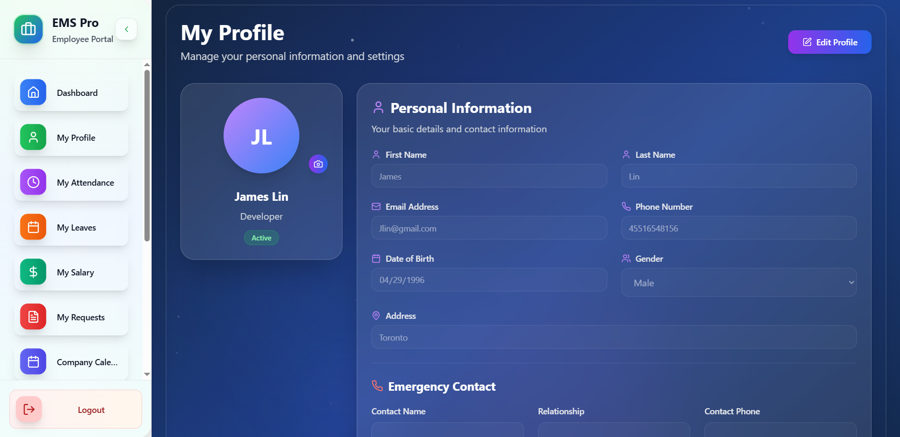

# 🏢 EMS Pro - Employee Management System

> A comprehensive, modern HR management solution built with cutting-edge web technologies

[](https://reactjs.org/)
[](https://nodejs.org/)
[](https://mongodb.com/)
[](https://expressjs.com/)
[](https://tailwindcss.com/)
[](https://vitejs.dev/)

## 📋 Table of Contents

- [Overview](#-overview)
- [Features](#-features)
- [Tech Stack](#-tech-stack)
- [Screenshots](#-screenshots)
- [Usage](#-usage)
- [API Documentation](#-api-documentation)
- [Database Schema](#-database-schema)
- [Project Structure](#-project-structure)
- [Development Process](#-development-process)
- [Future Enhancements](#-future-enhancements)
- [Contributing](#-contributing)
- [License](#-license)
- [Contact](#-contact)

## 🌟 Overview

**EMS Pro** is a full-stack Employee Management System designed to streamline HR operations for modern businesses. Built over 2 months as a solo project, it demonstrates expertise in modern web development technologies and best practices.

### 🎯 Project Goals

- **Efficiency**: Streamline HR processes with automated workflows
- **User Experience**: Intuitive, responsive design for all user types
- **Security**: Robust authentication and authorization systems
- **Scalability**: Built with growth and expansion in mind
- **Modern Stack**: Utilizing cutting-edge web technologies

### 👨‍💻 Developer

**Satyam Patel** - Full-Stack Developer  
*Solo project developed from November 2024 to July 2025*

## ✨ Features

### 🔐 Authentication & Authorization
- **JWT-based Authentication** with secure token management
- **Role-based Access Control** (HR Admin, Employee)
- **Password Reset** functionality with email verification
- **Multi-factor Authentication** ready infrastructure

### 👥 Employee Management
- **Complete Employee Profiles** with personal and professional details
- **Department Management** with hierarchical organization
- **Employee Onboarding** workflow
- **Document Management** for employee files

### ⏰ Attendance System
- **Real-time Clock In/Out** functionality
- **Automated Time Tracking** with break management
- **Attendance Reports** with filtering and export options
- **Leave Management** with approval workflows

### 💰 Payroll Management
- **Automated Salary Calculations** with tax deductions
- **Payslip Generation** and distribution
- **Bonus and Incentive** management
- **Tax Compliance** calculations

### 📊 Analytics & Reporting
- **Real-time Dashboard** with key metrics
- **Custom Report Generation** with various filters
- **Data Visualization** with charts and graphs
- **Export Functionality** (PDF, Excel, CSV)

### 📱 Responsive Design
- **Mobile-first Approach** for all devices
- **Progressive Web App** capabilities
- **Offline Functionality** for critical features
- **Cross-browser Compatibility**

## 🛠 Tech Stack

### Frontend
- **React 18** - Modern UI library with hooks and context
- **Vite** - Fast build tool and development server
- **Tailwind CSS** - Utility-first CSS framework
- **Lucide React** - Beautiful, customizable icons
- **React Router** - Client-side routing
- **Axios** - HTTP client for API calls
- **React Toastify** - Elegant notifications

### Backend
- **Node.js** - JavaScript runtime environment
- **Express.js** - Fast, unopinionated web framework
- **MongoDB** - NoSQL database for flexible data storage
- **Mongoose** - MongoDB object modeling for Node.js
- **JWT** - Secure authentication tokens
- **Bcrypt** - Password hashing and salting
- **Multer** - File upload handling
- **Nodemailer** - Email sending capabilities

### Development Tools
- **ESLint** - Code linting and formatting
- **Prettier** - Code formatting
- **Git** - Version control
- **VS Code** - Development environment
- **Postman** - API testing and documentation

## 📸 Screenshots

### 🏠 Landing Page
*Modern, responsive landing page with gradient design and clear navigation*


### 👨‍💼 HR Dashboard
*Comprehensive HR admin dashboard with analytics and management tools*


### 👥 Employee Dashboard
*Clean, intuitive employee dashboard with quick access to important features*


### 👤 Employee Profile
*Detailed employee profile management interface*


### ⏰ Attendance Management
*Real-time attendance tracking with comprehensive management features*


### 🏢 Department Management
*Organized department structure and management system*


### 💰 Payroll Automation
*Automated payroll processing and salary management system*


##  Usage

### For HR Administrators

1. **Register/Login** as HR Admin
2. **Add Employees** with complete profile information
3. **Manage Departments** and organizational structure
4. **Review Attendance** and approve leave requests
5. **Process Payroll** and generate reports
6. **Monitor Analytics** through the dashboard

### For Employees

1. **Login** with provided credentials
2. **Clock In/Out** for attendance tracking
3. **Submit Leave Requests** through the system
4. **View Payslips** and attendance history
5. **Update Profile** information
6. **Access Company Resources**

## 📡 API Documentation

### Authentication Endpoints
```
POST /api/auth/login          # User login
POST /api/auth/register       # User registration
POST /api/auth/logout         # User logout
POST /api/auth/forgot         # Password reset request
POST /api/auth/reset/:token   # Password reset confirmation
```

### Employee Endpoints
```
GET    /api/employees         # Get all employees
POST   /api/employees         # Create new employee
GET    /api/employees/:id     # Get employee by ID
PUT    /api/employees/:id     # Update employee
DELETE /api/employees/:id     # Delete employee
```

### Attendance Endpoints
```
GET    /api/attendance        # Get attendance records
POST   /api/attendance/checkin    # Clock in
POST   /api/attendance/checkout   # Clock out
GET    /api/attendance/report     # Generate reports
```

### Payroll Endpoints
```
GET    /api/payroll           # Get payroll data
POST   /api/payroll/generate  # Generate payslips
GET    /api/payroll/:id       # Get specific payslip
```

## 🗄 Database Schema

### User Model
```javascript
{
  _id: ObjectId,
  firstName: String,
  lastName: String,
  email: String (unique),
  password: String (hashed),
  role: String (enum: ['HR', 'Employee']),
  employeeId: String (unique),
  department: ObjectId (ref: Department),
  isActive: Boolean,
  createdAt: Date,
  updatedAt: Date
}
```

### Attendance Model
```javascript
{
  _id: ObjectId,
  employeeId: ObjectId (ref: User),
  date: Date,
  checkIn: Date,
  checkOut: Date,
  totalHours: Number,
  status: String (enum: ['Present', 'Absent', 'Late']),
  createdAt: Date
}
```

### Department Model
```javascript
{
  _id: ObjectId,
  name: String,
  description: String,
  manager: ObjectId (ref: User),
  employees: [ObjectId] (ref: User),
  createdAt: Date
}
```

## 📁 Project Structure

```
employee-management-system/
├── client/                   # Frontend React application
│   ├── public/              # Static assets
│   ├── src/
│   │   ├── components/      # Reusable UI components
│   │   ├── pages/          # Page components
│   │   ├── hooks/          # Custom React hooks
│   │   ├── context/        # React context providers
│   │   ├── utils/          # Utility functions
│   │   ├── services/       # API service functions
│   │   └── App.jsx         # Main application component
│   ├── package.json
│   └── vite.config.js
├── server/                  # Backend Node.js application
│   ├── config/             # Database and app configuration
│   ├── controllers/        # Route controllers
│   ├── middleware/         # Custom middleware
│   ├── models/             # MongoDB models
│   ├── routes/             # API routes
│   ├── utils/              # Utility functions
│   ├── package.json
│   └── index.js            # Server entry point
├── screenshots/            # Project screenshots
├── docs/                   # Additional documentation
└── README.md
```

## 🔄 Development Process

### Phase 1: Planning & Design (Week 1)
- ✅ Requirements analysis and feature planning
- ✅ Database schema design
- ✅ UI/UX wireframe creation
- ✅ Technology stack selection

### Phase 2: Backend Development (Weeks 2-4)
- ✅ Express.js server setup
- ✅ MongoDB database configuration
- ✅ Authentication system implementation
- ✅ RESTful API development
- ✅ Security middleware implementation

### Phase 3: Frontend Development (Weeks 4-6)
- ✅ React application setup with Vite
- ✅ Component architecture design
- ✅ State management with Context API
- ✅ Responsive UI with Tailwind CSS
- ✅ API integration

### Phase 4: Integration & Testing (Weeks 7-8)
- ✅ Frontend-backend integration
- ✅ User authentication flow
- ✅ Feature testing and bug fixes
- ✅ Performance optimization
- ✅ Cross-browser testing

### Phase 5: Deployment & Documentation (Week 8)
- ✅ Production build optimization
- ✅ Documentation creation
- ✅ Code cleanup and commenting
- ✅ Final testing and validation

## 🔮 Future Enhancements

### Short-term Goals
- [ ] **Push Notifications** for important updates
- [ ] **Advanced Reporting** with custom filters
- [ ] **Mobile Application** (React Native)
- [ ] **Integration APIs** for third-party services

### Long-term Vision
- [ ] **AI-powered Analytics** for HR insights
- [ ] **Microservices Architecture** for scalability
- [ ] **Multi-tenant Support** for multiple organizations
- [ ] **Advanced Security** with biometric authentication

## 🤝 Contributing

While this is primarily a solo project for portfolio demonstration, contributions are welcome! Please follow these steps:

1. Fork the repository
2. Create a feature branch (`git checkout -b feature/AmazingFeature`)
3. Commit your changes (`git commit -m 'Add some AmazingFeature'`)
4. Push to the branch (`git push origin feature/AmazingFeature`)
5. Open a Pull Request

### Development Guidelines
- Follow existing code style and conventions
- Write clear, descriptive commit messages
- Include appropriate tests for new features
- Update documentation as needed

## 📄 License

This project is licensed under the MIT License - see the [LICENSE](LICENSE) file for details.

## 📞 Contact

**Satyam Patel**  
Full-Stack Developer

- 💼 **LinkedIn**: [\[LinkedIn Profile\]](https://www.linkedin.com/in/satyampatel779/)
- 📧 **Email**: Satyampatel779@gmail.com
- 💻 **GitHub**: [\[GitHub Profile\]](https://github.com/Satyampatel779)

---

## 🙏 Acknowledgments

- React.js community for excellent documentation
- Tailwind CSS for the amazing utility-first framework
- MongoDB for the flexible NoSQL database
- Node.js ecosystem for robust backend tools
- Open source community for inspiration and resources

---

<div align="center">
  <p><strong>Built with ❤️ by Satyam Patel</strong></p>
  <p><em>Showcasing modern web development skills through practical application</em></p>
</div>
